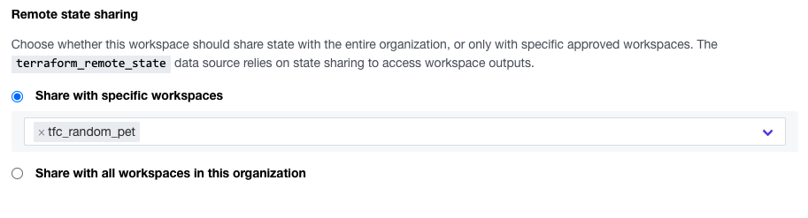

# TFC Random Pet

This repository reads the output from of a different statefile using terraform_remote_state  

The other statefile being used is created with this repository https://github.com/munnep/random_pet

Official documentation: https://www.terraform.io/language/state/remote-state-data

# How to

- Make sure the random_pet repository https://github.com/munnep/random_pet is in your TFC as a workspace
- change the values in the ```provider.tf``` to match your TFC environment
```
  config = {
    organization = "patrickmunne"       <-- your organization
    workspaces = {
      name = "random_pet"               <-- your workspace
    }
```    

## Terraform ClI
- run terraform init
```
terraform init
```
- run terraform plan
```
terraform plan
```
- run terraform apply
```
terraform apply
```
- output example
```
the_petname_other_repo = "prompt-newt"
```

## Terraform Cloud

- add this repository to you TFC as a workspace example tfc_random_pet
- give the correct privileges on the other TFC workspace that the tfc_random_pet workspace is allowed to view this state file
    - Go to the workspace which statefile you should be able to read
    - Go to settings -> General
    - Go to remote state sharing and add the workspace that should have this privilege  
  
- Run a plan and apply in your workspace tfc_random_pet and it should give you the output of the random_pet
  